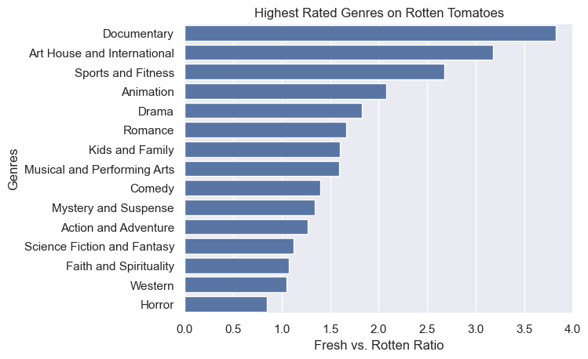
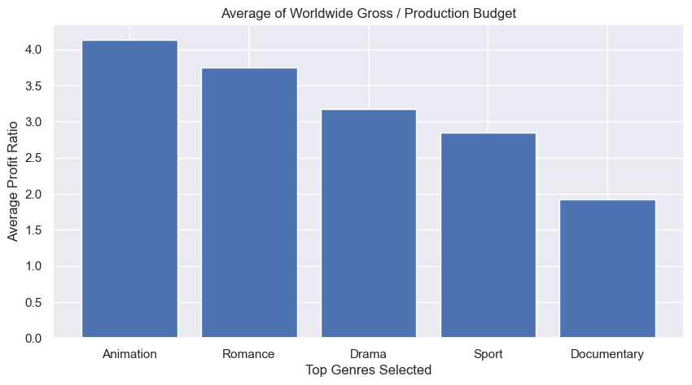
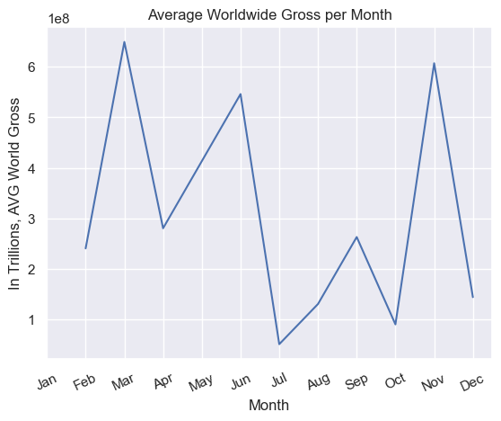
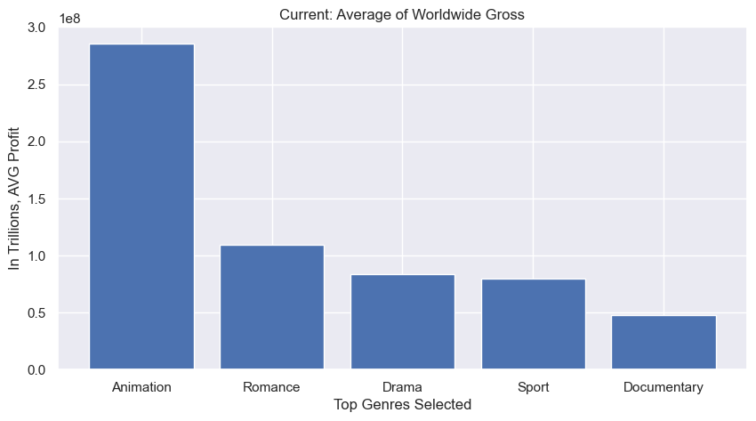

## Overview
For the phase 2 project, I explored multiple datasets so that a company that has created a new movie studio can decide on their trajectory of movies to make.

## Business Understanding
First, I made the assumption that this company is based in North America and their target market is an English-speaking audience. I wanted to see what were the highest rated genres, followed by which of those genres have the highest average worldwide revenue. Project budget was also taken into account. I also considered the creative aspect, so I looked at the highest rated directors and writers. The data also offered release dates, so I could look into which month was the best to release said movie. Finally, I noticed the datasets were prior to 2020 and I was curious what the status of movies were post COVID-19. I was able to scrape for additional data.

## Data Understanding and Analysis
The initial datasets are from:
- [Box Office Mojo](https://www.boxofficemojo.com/)
- [IMDB](https://www.imdb.com/)
- [Rotten Tomatoes](https://www.rottentomatoes.com/)
- [TheMovieDB](https://www.themoviedb.org/)
- [The Numbers](https://www.the-numbers.com/)

Additional data was scrapped from:
- [Box Office Mojo](https://www.boxofficemojo.com/), to obtain data from the past 2 years.

Rotten Tomatoes was used for identifying genres, and I also used their Fresh (60% rating or higher) vs. Rotten metric. IMDB had the most robust dataset, and was used for Directors and Writers, as well as ratings. Box Office Mojo and The Numbers were used for worldwide revenue and production budget. I ended up not using TheMovieDB for this project.

According to Rotten Tomatoes, the highest rated genre was Documentary, followed by Art House and International. Considering the nature of both of theses genres, this could be a concern for the company. Documentaries are usually not a sit down at a theater experience. Art House is also known to quite limited, International being attached may pose an issue since I assume this company is based in North America. I then decided to expand to look into the top five highest rated genres to give this company some options. I looked into the average of worldwide gross divided by production budget.

IMDB does not use Art House and International as an identifiable genre. Investigating films from Rotten Tomatoes, IMDB lists these films in the broader genre categories - Fantasy, Drama, etc. Therefore, I added the genre in Rotten Tomatoes' sixth place, Romance, for observation. Despite being the highest rated genre, Documentary had the lowest average profit. However, of the highest rated genres, this shows that Animation makes the most worldwide profit and in relation to its production budget and decided to observe Animation further.

I also wanted to see who were the highest rated directors and writers in Animation would could be contacted for this movie. According to IMDB, the highest rated director and writer is Mert Gokalp. However, he would be an international pick and his film with animation, Bluefish, is predominately a documentary. Therefore, Rodney Rothman, who worked on Marvel's first Spidervese film would be this company's choice. Rothman is also second on the list for writers.

As the datasets had release date information, I could see which month, on average, is when Animation makes the most worldwide revenue.

March is the best month to release an animated movie, followed by November. It should be noted that the dataset did not list any animated movies released in January. It can be implied that an animated movie released in November is meant to carry through the holiday season before release a more profitable movie in March, but that needs to be further investigated.

Finally, I scrapped additional data from Box Office Mojo to see the current state of the top five genres previously established. 

Animation currently has the highest average worldwide gross, while noting that this data reflects the start of November, which reflect its lead based on information when it is best to release a movie of this genre.

## Conclusion
In regards to return of investment, the highest rated genre that on average offers the highest worldwide revenue in relation to its production budget, is animation. Within the animation genre creative field, Rodney Rothman is the highest rated director and writer. Also, the best month to release an animated movie is in November, followed by March. Also, more current data is showing that animation is earning more worldwide revenue when compared to its previously higher rated genres.